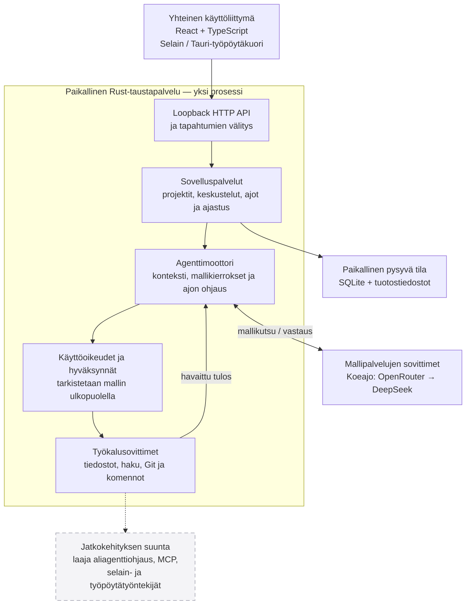

# Agent OS:n arkkitehtuuritiivistelmä

Loogiset kerrokset ovat erillisiä, mutta API, sovelluspalvelut, agenttimoottori ja ajastus toimivat yhdessä paikallisessa Rust-taustapalvelussa. Työpöytäkuoren toteutusta ei ajettu tässä työnäytteessä; koeajo tehtiin selainkäyttöliittymällä.

Kaavio näyttää komponenttien vastuut. Se ei lupaa kaikkien tiekartan ominaisuuksien olevan toteutettuja tai tässä koeajossa testattuja. Paikallisen komentotulkin käyttö ei itsessään ole käyttöjärjestelmätason hiekkalaatikko.
