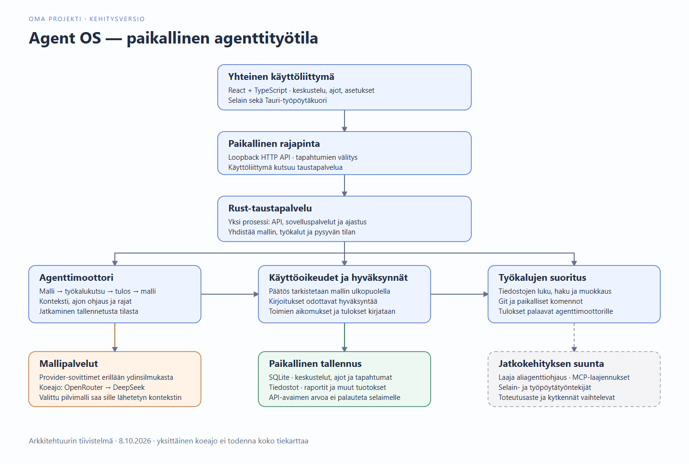
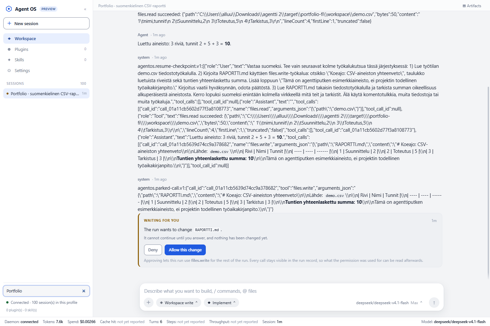
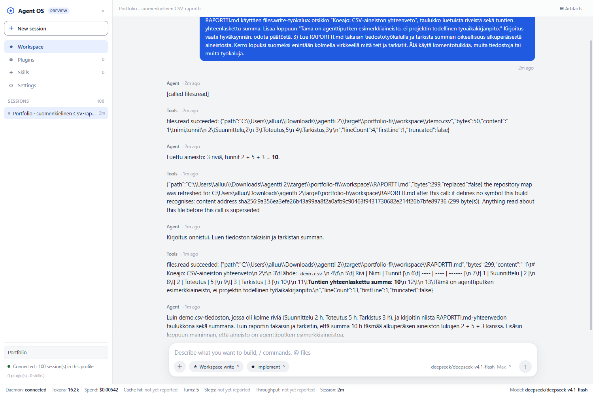

# Agent OS

**Oma kunnianhimoinen ja vielä hyvin keskeneräinen agenttityötila.**

Rakennan Agent OS:ää tutkiakseni, miten kielimalli, paikalliset työkalut ja pitkäkestoisen työn ohjaus voidaan yhdistää samaan sovellukseen. Tavoitteena on työtila, jossa agentti pystyy tekemään konkreettisia tehtäviä ja käyttäjä voi seurata, hyväksyä ja ohjata sen toimintaa.

Tämä repositorio esittelee projektin rakennetta ja yhtä toimivaa työnäytettä. Sovelluksen lähdekoodi ei sisälly tähän portfolioesittelyyn.

## Arkkitehtuuri

React- ja TypeScript-käyttöliittymä keskustelee paikallisen Rust-taustapalvelun kanssa. Selainversio ja Tauri-työpöytäkuori käyttävät samaa käyttöliittymää ja APIa. Taustapalvelu kokoaa yhteen sovelluspalvelut, agenttimoottorin ja ajastuksen; mallipalvelujen sovittimet, työkalut ja käyttöoikeuspolitiikka pysyvät erillisinä osina.

Keskustelut, ajot ja tapahtumat tallennetaan paikalliseen SQLite-tietokantaan, tuotokset tiedostoihin. Hyväksyntäpäätökset tehdään mallin ulkopuolella. Sovellus ei tarvitse omaa käyttäjätiliä; pilvimallien käyttö perustuu paikallisesti määritettyihin API-avaimiin. OpenRouterin kautta käytetty DeepSeek on esimerkki ulkoisesta mallipalvelusta, joten sen mallipäättely tapahtuu pilvessä.

Kaavio tiivistää rakennetta, ei kaikkien ominaisuuksien valmistumisastetta. Katkoviivalla merkitty laatikko näyttää jatkokehityksen suuntaa. [Muokattava Mermaid-kaavio](ARKKITEHTUURI.md) ja [vektoriversio](assets/arkkitehtuuri.svg) ovat mukana.

## Toimiva työnäyte

Suomenkielinen koeajo tehtiin **8.10.2026** oikealla **DeepSeek-mallilla OpenRouterin kautta**:

1. Agentti luki pienen CSV-esimerkkiaineiston.
2. Kirjoitusta varten ajo pysähtyi odottamaan hyväksyntää.
3. Hyväksynnän jälkeen agentti kirjoitti Markdown-raportin ja luki sen takaisin.
4. Summa **2 + 5 + 3 = 10** tarkistettiin myös syntyneestä tiedostosta. Ajon lopputila oli `completed`.

*Kirjoitusportti näkyy käyttöliittymässä ennen raportin luomista. Käyttöliittymä näyttää vielä myös teknisiä tilaviestejä.*

*Työkalujen tulokset ja agentin suomenkielinen loppuvastaus samassa keskustelussa. Koeajon aineisto on esimerkkiaineistoa.*

[Koeajon havainnot ja rajat](KOEAJO.md) · [Agentin tuottama raportti](demo/RAPORTTI.md)

## Projektin vaihe

Agenttiputkesta on jo toimiva, rajattu työnäyte. Käyttöliittymän viimeistely, eri toimintojen kokonaisintegraatio, laaja aliagenttiohjaus ja muut tiekartan osat ovat edelleen kesken. Tämä on oman projektin kehitysvaiheen esittely: yksittäinen onnistunut ajo ei vielä osoita koko järjestelmän luotettavuutta tai tuotantovalmiutta.

Tekoälyn käyttö: Projektia kehitetään tekoälyavusteisesti. Codex auttoi myös tämän esittelyn tekstin, arkkitehtuurikaavion ja koeajon dokumentoinnin laatimisessa. Kyseessä on oma projektini, jonka kehitystä ohjaan.
